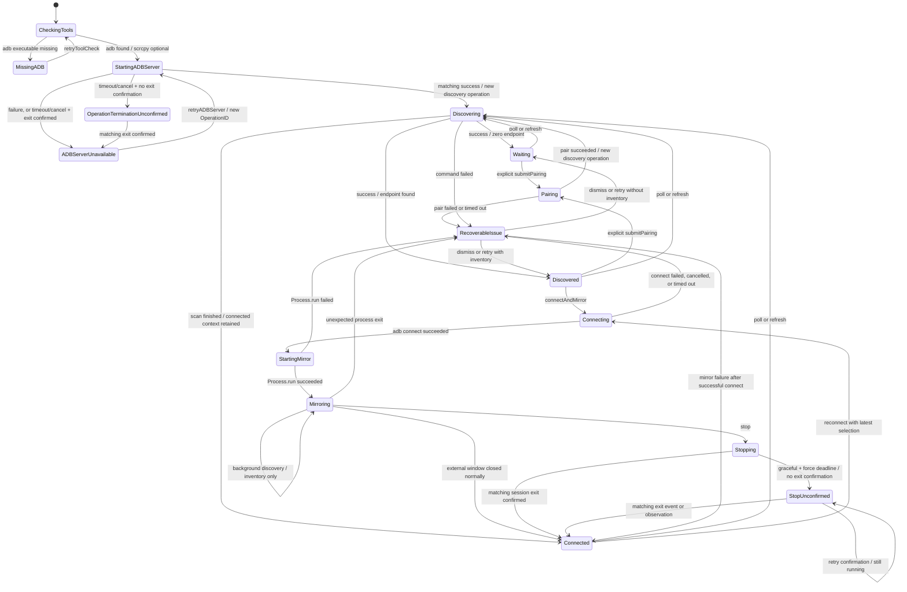
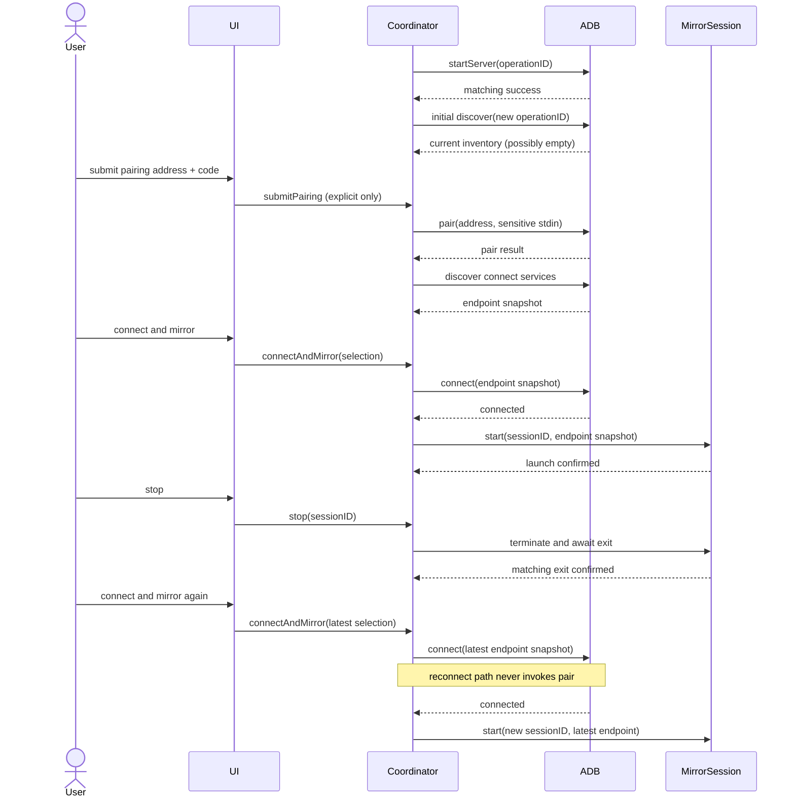

# MirrorBridge v0.1 连接与镜像生命周期契约

- 状态：设计提案，等待所有者确认
- 版本：v0.1
- 适用基线：`8c8a103`（2026-08-27 的 `main`）
- 目标平台：macOS 13+、Swift 5.9+、Android 11+
- 关联任务：JODER-43

本文是 Stage 2 实现的约束性契约。实现可以调整类型名和文件拆分，但不得改变本文规定的所有权、状态转换、失败语义、敏感信息边界和验收行为。若实现需要改变这些口径，必须先更新设计并由所有者确认。

## 1. 已批准范围

v0.1 是开发者预览：用户自行安装 `adb` 与 `scrcpy`，MirrorBridge 只负责调用它们；scrcpy 使用独立外部窗口。最小成功链路是：

1. 用户显式提交一次配对地址和配对码。
2. MirrorBridge 自动发现 `_adb-tls-connect._tcp` 服务。
3. 用户选择设备并执行“连接并镜像”。
4. 用户停止当前镜像。
5. 用户再次连接并镜像，过程中不得再次调用 `adb pair`。

自动发现不等于自动配对或自动连接。v0.1 不打包第三方工具，不实现 Smart View/Miracast、内嵌视频协议、云服务、账号体系或 App Store 发布流程。

## 2. 当前代码事实与需要收口的风险

当前实现已经具备最小命令路径，但还不能作为并发生命周期契约：

| 代码事实 | 风险 | 本契约的收口方式 |
| --- | --- | --- |
| `AppModel` 同时维护 `state`、`isBusy`、`isMirroring`、设备数组和回调 | 多个可变字段可以形成互相矛盾的组合 | 单一 `LifecycleSnapshot`；忙碌和按钮能力全部派生 |
| `Task` 创建后未保存连接/配对任务句柄 | 无法在退出、停止或超时时取消 | 协调器独占快照中一个带令牌的 `operation` |
| `CommandRunner` 使用 `waitUntilExit()`，退出后才读取管道 | 高输出命令可能阻塞；无超时或取消 | 进程执行器并发排空输出，并负责超时、终止和确认退出 |
| 配对码作为 `adb pair` 的命令行参数 | 配对码可能出现在进程参数检查工具中 | 仅通过标准输入传入；禁止回退到参数传递 |
| `refreshLoop()` 调用 `startServer()` 后无论结果都继续发现 | ADB server 启动失败会被伪装成发现失败，重试边界不唯一 | 独立 `adbServer` readiness；只有匹配启动成功才进入发现 |
| `ScrcpyService.start()` 会隐式调用 `stop()` | 新旧进程可短暂重叠，旧退出回调可能覆盖新状态 | 启停只能由协调器串行发起，启动器不得隐式停止旧会话 |
| scrcpy 回调没有会话标识 | 旧进程迟到的输出/退出会改变新会话 | 每个会话携带 `SessionID`，不匹配事件只记结构化调试项 |
| 设备身份以动态 endpoint 表示 | 端口变化后选择丢失或连错设备 | 将发现服务标识与本次 endpoint 快照分开建模 |

## 3. 方案选择

### 3.1 采用：纯状态转换器 + 主线程协调器 + 进程适配器

`LifecycleReducer` 是无副作用值类型，只根据当前快照和事件产生新快照与待执行效果；`ConnectionCoordinator` 位于 `@MainActor`，执行效果并把结果重新送回 reducer。ADB、发现、scrcpy、时钟和诊断均通过协议注入。

选择理由：

- 状态转换可以在没有设备和外部进程时完整测试。
- UI 更新仍在主线程，符合现有 SwiftUI 结构。
- 进程和协议细节被隔离，取消、超时及旧回调检查只有一个所有者。
- 相比引入第三方状态框架，新增概念有限，适合 v0.1。

### 3.2 拒绝：继续扩展单体 `AppModel` 与布尔量

该方案改动最少，但无法从类型层面保证单一有效操作和单一会话；重复点击、停止与退出回调会继续通过条件分支偶然协调，测试只能覆盖部分组合。

### 3.3 拒绝：只使用一个 actor 包装现有回调

actor 可以消除数据竞争，但不能自动消除非法状态组合，也会让测试依赖异步时序。它可以作为适配器内部实现手段，不能替代显式状态机。

### 3.4 暂不采用：独立守护进程/XPC 或完整状态框架

独立进程能提供更强的崩溃隔离，完整框架能统一 effect 管理，但二者都会扩大安装、签名、依赖和调试面。v0.1 的单窗口开发者预览不需要这类成本。

## 4. 模块边界与依赖方向

```text
ContentView
    -> AppModel (兼容现有 View 的薄门面)
        -> ConnectionCoordinator (@MainActor，唯一编排所有者)
            -> LifecycleReducer (纯 Swift，无 Foundation.Process)
            -> ADBClient
                -> ProcessExecuting
            -> ScrcpySessionFactory
                -> ScrcpySession
                    -> ProcessExecuting
            -> DiscoveryClock
            -> DiagnosticsSink
```

依赖只能向下：UI 不持有服务或进程；reducer 不依赖 UI、`Process`、真实时钟或文件系统；ADB 与 scrcpy 适配器不能直接改 UI 状态。

| 模块 | 拥有 | 不拥有 |
| --- | --- | --- |
| `ContentView` | 用户输入和展示 | 命令、任务、进程、重试策略 |
| `AppModel` | SwiftUI 发布属性的只读映射 | 独立状态事实、并发控制 |
| `ConnectionCoordinator` | 当前快照、一个 ADB 操作、一个 scrcpy 会话、一次性敏感输入槽、轮询调度 | 命令解析细节、日志文本拼接 |
| `LifecycleReducer` | 合法转换、效果描述、可用动作推导 | I/O、时间、随机 ID |
| `ADBClient` | ADB 命令语义及输出归一化 | UI 状态、自动配对策略 |
| `ProcessExecuting` | 子进程、管道、取消、超时、退出确认 | ADB/scrcpy 业务判断 |
| `ScrcpySession` | 一个 scrcpy 子进程及其事件流 | 选择设备或启动另一会话 |
| `DiagnosticsSink` | 有界、脱敏、内存内诊断事件 | 配对码、持久化、产品状态 |

## 5. 单一组合状态模型

实现应表达下列语义；命名可以等价调整：

```swift
struct LifecycleSnapshot: Equatable, Sendable {
    var tools: ToolReadiness
    var adbServer: ADBServerReadiness
    var stable: StablePhase
    var operation: ConnectionOperation?
    var mirror: MirrorLifecycle?
    var inventory: DiscoveryInventory
    var selection: DiscoveryID?
    var issue: LifecycleIssue?
    var pendingRefresh: Bool
}

enum ToolReadiness: Equatable, Sendable {
    case checking
    case missingADB
    case missingScrcpy(adb: ToolDescriptor)
    case ready(adb: ToolDescriptor, scrcpy: ToolDescriptor)
}

enum ADBServerReadiness: Equatable, Sendable {
    case notStarted
    case ready
    case unavailable
}

enum StablePhase: Equatable, Sendable {
    case idle
    case waiting
    case discovered
    case connected(EndpointSnapshot) // 最近一次 adb connect 成功；不是持续健康探测
}

enum ConnectionOperation: Equatable, Sendable {
    case startingServer(OperationID)
    case discovering(OperationID)
    case pairing(OperationID)
    case connecting(OperationID, EndpointSnapshot)
}

enum MirrorLifecycle: Equatable, Sendable {
    case starting(SessionID, EndpointSnapshot)
    case running(SessionID, EndpointSnapshot)
    case stopping(SessionID, EndpointSnapshot)
    case stopUnconfirmed(SessionID, EndpointSnapshot, StopExitObservationPhase)
}

enum StopExitObservationPhase: Equatable, Sendable {
    case available
    case observing(ObservationID)
}
```

`stable` 保存最近一个没有进行中动作也成立的连接上下文；`operation` 和 `mirror` 是正交槽位，因此运行中的镜像可以与一次后台发现并存，但配对/连接不能与镜像并存。`adbServer == .notStarted` 表示尚无匹配的成功启动结果（包括工具检查中、缺 adb 或启动进行中），`.unavailable` 只表示 adb 可执行文件存在但最近一次启动失败、超时或取消，失败细节放在 `LifecycleIssue`。`LifecycleIssue` 是带稳定错误类型、恢复动作和返回阶段的可恢复问题，不保存原始 stderr。`isBusy`、`isMirroring`、按钮启用状态和标题均从快照派生，禁止再次成为独立可写事实。

### 5.1 必须始终成立的不变量

1. `operation` 最多一个；协调器中的 ADB Task 对应且只对应它的 `OperationID`。
2. `mirror` 最多一个；协调器中的 scrcpy Task/handle 对应且只对应它的 `SessionID`。
3. 启动新 scrcpy 前，旧会话必须已确认退出；“已发送 terminate”不等于已退出。
4. 只有 `submitPairing` 用户意图可以产生 `.pair` 效果。
5. 发现、连接、停止、重连、定时轮询和错误恢复均不得产生 `.pair`。
6. 异步结果必须同时匹配操作/会话令牌和预期阶段，否则是旧事件，不改变状态。
7. 活动会话使用启动时的 endpoint 快照；发现结果变化不能重定向正在运行的镜像。
8. 成功的零结果发现会清空当前 inventory；发现命令失败会保留但标记旧 inventory，二者不可混同。
9. 配对码不进入快照、效果记录、日志、持久化、进程参数或错误对象。
10. 未确认退出的进程仍占有操作或会话槽位，禁止为了“恢复 UI”而提前清空。
11. `.pairing` 或 `.connecting` operation 要求 `mirror == nil`；`.discovering` 是唯一允许与 `.running` mirror 并存的 ADB operation。
12. 一个 `SessionID` 的 `ScrcpySession.stop()` 全生命周期最多调用一次；进入 `.stopUnconfirmed` 后只能观察退出状态，禁止再次发送温和或强制终止信号。
13. `.discovering`、`.pairing` 和 `.connecting` 及其 ADB effect 都要求 `adbServer == .ready`；server 未就绪时唯一允许的 ADB effect 是 `.startServer`。
14. `.startingServer(op)` 必须对应 `adbServer != .ready`。失败、超时或取消只有在子进程确认退出后才可清空该 operation 并允许用新 `OperationID` 重试。

### 5.2 设备与 endpoint

```swift
struct DiscoveredEndpoint: Equatable, Sendable {
    let id: DiscoveryID
    let serviceName: String
    let endpoint: EndpointSnapshot
    let observedAt: ContinuousClock.Instant
}
```

- 只解析 `_adb-tls-connect._tcp`；配对地址仍由用户从 Android 配对页显式输入。
- `DiscoveryID` 优先使用非空 mDNS service name；缺失时使用规范化 endpoint，但它只是本次运行内的相关键，不是永久设备 ID。
- endpoint 必须作为不可变快照传给一次连接和一次会话。支持 `host:port` 与 `[ipv6]:port`，端口必须为 `1...65535`。
- 同一 `DiscoveryID` 出现新 endpoint 时，若没有活动连接/会话，选择跟随到新快照；活动流程只更新 inventory，不改变其快照。
- 一个设备时可以自动选择；多个设备且没有仍有效的历史选择时必须要求用户显式选择。排序只影响展示，不决定自动连接。
- 成功扫描中消失的条目立即从当前 inventory 移除；失败扫描保留上次结果并标为 stale，避免把“命令失败”伪装为“没有设备”。
- 不持久化设备列表、endpoint 或选择；重启后重新发现。ADB 自身维护的配对密钥属于外部工具，不由 MirrorBridge 复制或删除。

### 5.3 Intent、事件与效果边界

```swift
enum UserIntent: Sendable {
    case retryToolCheck
    case retryADBServer
    case refresh
    case select(DiscoveryID)
    case submitPairing(PairingSubmission) // 仅协调器入口可见敏感 code
    case connectAndMirror
    case stop
    case retryStopConfirmation
    case dismissIssue
}

enum LifecycleEvent: Equatable, Sendable {
    case toolsResolved(ToolReadiness)
    case pollTick
    case pairingRequested(OperationID, PairingAddress)
    case operationFinished(OperationID, ADBOutcome)
    case mirrorStarted(SessionID)
    case mirrorStartFailed(SessionID, ScrcpyFailure)
    case mirrorEvent(SessionID, ScrcpySessionEvent)
    case mirrorExitObserved(SessionID, ObservationID, ScrcpyExitObservation)
    case deadlineExceeded(DeadlineID)
    case appWillTerminate
}

enum LifecycleEffect: Equatable, Sendable {
    case inspectTools
    case runADB(OperationID, ADBAction)
    case startMirror(SessionID, EndpointSnapshot)
    case stopMirror(SessionID)
    case observeMirrorExit(SessionID, ObservationID)
    case schedulePoll
    case record(DiagnosticDescriptor)
}

enum ADBAction: Equatable, Sendable {
    case startServer
    case discover
    case pair(PairingAddress) // code 不在可记录 effect 中
    case connect(EndpointSnapshot)
}
```

`submitPairing` 由协调器先验证并立刻清空 UI 绑定，再把 code 放入仅由 `OperationID` 索引的一次性 `SensitiveInputSlot`，并向 reducer 发送 `.pairingRequested(id, address)`。执行 reducer 产生的 `.runADB(id, .pair(address))` 时，协调器恰好消费一次 code 并调用 `ADBClient.pair`，随后释放槽位。缺少、重复消费、取消或超时都必须关闭并释放槽位，不能重试旧 code。这样 reducer、快照、Equatable effect、调试输出和测试失败信息均不含 code。

所有不合法 intent 都返回 `CommandDisposition.ignored(reason)` 且效果数组为空。允许的恢复动作固定为 `retryToolCheck`、`retryADBServer`、`refreshDiscovery`、`resubmitPairing`、`retryConnectAndMirror`、`retryStopConfirmation` 和 `dismissIssue`；失败类型不能携带任意闭包或原始命令文本。`retryStopConfirmation` 是只读退出观察，不是第二次停止请求；`retryADBServer` 只重启 server，不隐式配对、连接或启动镜像。

## 6. 状态机与关键流程

本图回答“用户显式配对后，如何发现、连接、启动、停止并重连，以及失败后回到哪个可操作阶段”。状态闭环是主要复杂度，因此以状态机为主，后续时序图补充参与者顺序。



该图是组合状态的评审视图，不表示后台发现会替换 `.running` mirror；实现中的 `operation` 与 `mirror` 仍按第 5 节正交保存。`RecoverableIssue` 是稳定阶段上的问题数据，不要求单独复制所有状态。图中把它展开，是为了明确失败必须有终点和恢复所有者。

### 6.1 首次配对到停止后重连



### 6.2 事件、转换与重复操作表

表内分别写明 `stable`、`operation` 或 `mirror` 槽位；未提及的槽位保持不变。

| 当前条件 | 事件 | 效果 | 下一状态/确定行为 |
| --- | --- | --- | --- |
| 初始快照 | 协调器启动 | 仅执行 `inspectTools` | `tools = .checking`、`adbServer = .notStarted`、`operation = nil`；任何 ADB intent 均禁用 |
| `tools = .checking` | 工具检查完成，缺 adb | 不启动 ADB server | `tools = .missingADB`、`adbServer = .notStarted`、`stable = .idle`；仅允许重查工具 |
| `tools = .checking` | 工具检查完成，找到 adb（scrcpy 可有可无） | 分配 `OperationID`，执行一次 `.runADB(op, .startServer)` | 保存 `.ready` 或 `.missingScrcpy` 工具结果；`adbServer = .notStarted`、`operation = .startingServer(op)`；其他 ADB intent 禁用 |
| `operation = .startingServer(op)` | 匹配成功 | 清除问题；以新 `OperationID` 立即执行 discover，并启动单一轮询调度 | `adbServer = .ready`、`operation = .discovering(newOp)`；不得复用 server operation ID |
| `operation = .startingServer(op)` | 匹配的启动失败、非零退出、超时或取消，且子进程已确认退出 | 不发现、不配对、不连接 | `adbServer = .unavailable`、`operation = nil`、原 stable/inventory 保留并标 stale，附不可 dismiss 的 `adbServerUnavailable` |
| `operation = .startingServer(op)` | 截止/取消后子进程退出仍未确认 | 不启动任何新 effect | 保留 `.startingServer(op)` 槽位并附 `operationTerminationUnconfirmed`；等待匹配退出或 App 退出，不能重试 |
| `operation = .startingServer(op)` + `operationTerminationUnconfirmed` | 同一子进程最终确认退出 | 不发现、不自动重试 | `adbServer = .unavailable`、`operation = nil`，问题替换为 `adbServerUnavailable`；此时才开放重试 |
| `adbServer = .unavailable`、`operation == nil` | `retryADBServer` | 分配新 `OperationID`，仅执行 `.startServer` | `adbServer = .notStarted`、`operation = .startingServer(newOp)`；成功后才发现 |
| `adbServer = .unavailable`、`operation == nil` | `retryToolCheck` | 仅重新执行 `inspectTools` | `tools = .checking`、`adbServer = .notStarted`；重新找到 adb 后走新的 `.startingServer`，找不到则进入 `missingADB` |
| `operation = .startingServer` | 再次 `retryADBServer` / `refresh` / `submitPairing` / `connectAndMirror` | 无效果 | 返回 `operationInProgress`；不得消费配对码或设置 `pendingRefresh` |
| `adbServer != .ready` | `pollTick` | 无效果 | 不设置 `pendingRefresh`；server 恢复成功后的首次发现会重新建立轮询 |
| `adbServer = .ready` | `pollTick` / `refresh` | 若无活动 ADB 操作则执行一次发现 | `operation = .discovering(op)`；重复刷新合并为一个 `pendingRefresh` |
| 任意稳定阶段 | 发现成功且零结果 | 清空 inventory | `stable = .waiting`，但已有 `.connected` 上下文时保留；不是错误 |
| 任意稳定阶段 | 发现成功且有结果 | 原子替换 inventory，按规则保持选择 | `stable = .discovered` 或保持 `.connected` |
| 任意稳定阶段 | 发现失败/超时 | 保留旧 inventory 并标 stale | 回到原稳定阶段并附 `discoveryFailed` |
| `stable = .waiting/.discovered`，`mirror == nil` | 用户显式 `submitPairing` | 清空 UI 中配对码后，仅执行一次 `adb pair` | `operation = .pairing(op)` |
| `operation = .pairing(op)` | 匹配的成功结果 | 清除问题并立即安排发现 | `stable = .waiting`，随后 `operation = .discovering(newOp)` |
| `operation = .pairing(op)` | 失败/超时 | 不修改配对信任或 inventory | `operation = nil`，原 stable + `pairFailed`；允许重新输入并重试 |
| 任意忙碌或镜像阶段 | 再次配对 | 无效果 | 忽略并返回 `operationInProgress`；必须先停止镜像 |
| `stable = .discovered/.connected`，`operation == nil`，`mirror == nil` | `connectAndMirror` | 固定当前 endpoint，执行 `adb connect` | `operation = .connecting(op, endpoint)` |
| `operation = .connecting(op)` | 匹配的成功结果 | 清空 operation，分配 `SessionID` 并启动 scrcpy | `stable = .connected(endpoint)`，`mirror = .starting(session, endpoint)` |
| `operation = .connecting(op)` | 失败/超时 | 清空 operation，不启动 scrcpy | 原 stable + `connectFailed`；可刷新或重试 |
| `mirror = .starting(session)` | 启动确认 | 安装事件流并发布活动会话 | `mirror = .running(session, endpoint)` |
| `mirror = .starting(session)` | `Process.run()` 抛错 | 确认没有遗留进程并清空 mirror | `stable = .connected(endpoint)` + `scrcpyStartFailed` |
| `operation = .connecting` 或 `mirror = .starting` | `stop` | 取消活动任务；若会话已创建则终止并等待 | 清空相应槽位，回到 inventory 对应 stable；迟到结果因令牌失效而忽略 |
| `operation = .connecting` 或 `mirror = .starting` | 再次 `connectAndMirror` | 无效果 | 原状态不变，返回 `operationInProgress` |
| `mirror = .running` | 再次 `connectAndMirror` | 不 connect、不启动第二进程 | 原状态不变，返回 `alreadyMirroring` |
| `mirror = .running(session)` | 首次 `stop` | 标记 stop requested，终止并等待同一会话 | `mirror = .stopping(session)`；连接按钮禁用 |
| `mirror = .stopping(session)` | 第二次 `stop` | 无效果 | 幂等地保持 `.stopping` |
| `mirror = .stopping(session)` | 匹配退出确认 | 清空 mirror | `stable = .connected(endpoint)`；允许再次连接 |
| `mirror = .stopping(session)` | 3 秒温和终止 + 1 秒强制终止后仍无退出确认 | 不再调用 `session.stop()` | `mirror = .stopUnconfirmed(session, endpoint, .available)` + `sessionStopUnconfirmed`；保留会话槽并阻断重连 |
| `mirror = .stopUnconfirmed(session, endpoint, .available)` | `retryStopConfirmation` | 分配 `ObservationID`，只执行 `observeMirrorExit` | `mirror = .stopUnconfirmed(session, endpoint, .observing(observation))`；不发送任何信号 |
| `mirror = .stopUnconfirmed(..., .observing)` | 再次 `retryStopConfirmation` | 无新效果 | 返回 `coalesced`，保持同一 observation |
| `mirror = .stopUnconfirmed(session, ..., .observing(observation))` | 匹配观察结果为 `stillRunning` | 无停止效果 | 回到 `.stopUnconfirmed(..., .available)`，保留问题和槽位 |
| `mirror = .stopping/.stopUnconfirmed(session)` | 匹配退出事件，或匹配观察结果为 `exited` | 释放同一 session handle | 清空 mirror 与 `sessionStopUnconfirmed`，`stable = .connected(endpoint)`；允许再次连接 |
| `mirror = .stopUnconfirmed` | `stop` | 无效果 | 返回 `stopAlreadyRequested`；恢复入口只能是 `retryStopConfirmation` |
| `mirror = .running(session)` | 外部窗口自行正常关闭 | 清空 mirror | `stable = .connected(endpoint)` + 非错误提示 |
| `mirror = .running(session)` | 非零/异常退出 | 清空 mirror | `stable = .connected(endpoint)` + `scrcpyExitedUnexpectedly` |
| 任意阶段 | 旧 `OperationID` 结果 | 不解析为当前业务结果 | 状态不变；只记无原始输出的 stale-event 调试项 |
| 任意阶段 | 旧 `SessionID` 输出/退出 | 不追加原始输出，不清空当前会话 | 状态不变；只记 stale-event 调试项 |
| `mirror = .running` | 发现到同设备新 endpoint | 更新 inventory，不改活动快照 | 当前镜像继续；下次连接使用新 endpoint |
| 任意阶段 | App 退出 | 取消轮询和活动命令，停止活动会话 | 尽力回收；不启动新效果、不持久化快照 |

`start-server` 重试总是分配新 `OperationID`。旧启动回调即使报告成功也不能把 `adbServer` 改成 `.ready`、触发发现或清除当前问题；只有同时匹配 `.startingServer(currentID)` 的结果才可转换。`appWillTerminate` 在 `.startingServer` 中取消 task 和子进程、等待退出确认并抑制所有后续效果；因为应用正在终止，不进入可重试 UI 状态。

## 7. 外部命令与会话契约

### 7.1 可注入接口

```swift
protocol ProcessExecuting: Sendable {
    func run(_ request: ProcessRequest) async throws -> ProcessResult
}

protocol ADBClient: Sendable {
    func startServer() async throws
    func pair(address: PairingAddress, code: SensitivePairingCode) async throws
    func discoverConnectServices() async throws -> [DiscoveredEndpoint]
    func connect(to endpoint: EndpointSnapshot) async throws -> ConnectDisposition
}

protocol ScrcpySessionFactory: Sendable {
    func start(id: SessionID, endpoint: EndpointSnapshot) async throws -> any ScrcpySession
}

protocol ScrcpySession: Sendable {
    var id: SessionID { get }
    var events: AsyncStream<ScrcpySessionEvent> { get }
    func stop() async throws
    func observeExit() async -> ScrcpyExitObservation
}

protocol DiscoveryClock: Sendable {
    func sleep(until deadline: ContinuousClock.Instant) async throws
}

protocol DiagnosticsSink: Sendable {
    func record(_ event: DiagnosticEvent)
}
```

`ProcessResult` 必须同时保留退出码、终止原因、经过脱敏的 stdout/stderr 和时长；状态机只接收归一化结果，不依赖任意错误字符串。`ConnectDisposition` 至少区分 `connected` 与 `alreadyConnected`，二者都可继续启动 scrcpy。

### 7.2 命令所有权、取消与截止时间

| 操作 | 默认截止时间 | 超时/取消后的要求 |
| --- | ---: | --- |
| `adb start-server` | 5 秒 | 终止并确认退出；匹配失败/超时/取消进入 `adbServerUnavailable`，不继续发现 |
| `adb mdns services` | 5 秒 | 终止并确认退出；保留 stale inventory；后续轮询可重试 |
| `adb pair` | 30 秒 | 终止并确认退出；立即释放应用持有的配对码引用；仅允许用户重新提交 |
| `adb connect` | 15 秒 | 终止并确认退出；不得启动 scrcpy |
| scrcpy 进程创建与 `Process.run()` | 5 秒 | 若未确认成功，回收已创建进程后才释放会话槽位 |
| scrcpy 停止 | 3 秒温和终止 + 1 秒强制终止确认 | 未确认退出时保留会话槽位并进入 `.stopUnconfirmed`，禁止重连；不得再次调用 `stop()` |

这些值是 v0.1 默认值，必须通过配置/时钟注入以便测试；不允许 UI 自行覆盖。Task 取消必须传递到子进程：关闭 stdin，发送终止信号，继续并发排空 stdout/stderr，并等待 termination handler。ADB operation 的 `failed`、`timedOut` 或 `cancelled` 只有在子进程确认退出后才是可清槽的终态；若强制终止后仍无法确认退出，保留原 operation 并进入 `operationTerminationUnconfirmed`，直到匹配退出或 App 退出，不能冒险启动第二个命令或会话。`start-server` 的超时/取消归一化为 `adbServerUnavailable`，不再同时产生泛化的 `operationTimedOut`。

`ScrcpySession.stop()` 内部拥有一次性的温和终止、强制终止和首次退出等待；无论它成功、抛错还是超过确认期限，协调器都不得对同一 `SessionID` 再调用。`observeExit()` 只能查询进程/termination handler 已确认的事实，返回 `exited` 或 `stillRunning`，不得发送信号、启动进程或替换事件流。`.stopUnconfirmed` 期间原事件流继续有效：匹配退出事件是权威恢复路径；观察结果只是让用户主动刷新该事实。观察结果还必须匹配 `SessionID + ObservationID + .observing`，迟到或重复结果按旧事件忽略。

发现轮询默认每 3 秒一次。轮询没有并发实例：一个 tick 到来时若已有 ADB 操作，只设置布尔型 `pendingRefresh`；操作结束后最多补一次，不按 tick 数排队。配对、连接和停止期间暂停周期 tick；镜像期间可继续发现，但不得改变活动会话快照。

### 7.3 ADB 语义

- 工具检查发现 adb 后必须先执行一次 `startServer`；只有匹配成功才令 `adbServer = .ready` 并以新 operation 启动首次发现。失败不会继续发现，显式 `retryADBServer` 只重复该启动步骤。MirrorBridge 不周期重启 server，也不因普通 discovery/connect 失败自动重启它。
- `pair` 调用必须构造 `adb pair <address>`，通过单独 stdin pipe 写入配对码和换行，写完立即关闭并清空 UI 字段。若用户安装的 adb 不支持 stdin 配对，返回“不兼容的 Platform-Tools”并要求升级，禁止降级为命令行参数。
- `SensitivePairingCode` 不得支持编码或输出原值，`description`/debug 输出固定为 `<redacted>`。提交后先清空 UI 绑定，stdin 写入完成后立即释放引用；Swift `String` 不保证内存清零，本文不作无法实现的零化承诺。
- `discoverConnectServices` 只解析成功命令的 stdout。解析器忽略标题、空行、未知服务和畸形 endpoint，并以确定顺序返回去重结果。
- `connect` 以退出状态为主要依据，并识别 `connected to` / `already connected to` 与已知失败前缀；已知失败文本即使伴随零退出码也必须归一化为失败。
- `connected` 只表示最近一次 `adb connect` 成功。v0.1 没有持续的 `adb devices` 健康探测；UI 不得把它描述为实时在线保证。
- adb server 默认可能根据 `ADB_MDNS_AUTO_CONNECT` 自动连接已配对的 `_adb-tls-connect` 服务，也可能已被其他开发工具启动。MirrorBridge 不拥有全局 server，不执行 `kill-server`，也不把 server 的既有连接当作 UI 意图；启动 scrcpy 的门禁仍是本次用户动作触发的幂等 `adb connect` 成功。
- 停止只停止 scrcpy，不调用 `adb disconnect`。再次镜像总是先对最新 endpoint 执行 `adb connect`，但从不隐式配对。

### 7.4 scrcpy 语义

- 每次启动固定使用 `-s <endpoint>`；外部窗口标题可以含展示 endpoint，但诊断日志不得复制原值。
- Factory 不得隐式停止已有会话；协调器在调用 factory 前必须证明会话槽为空。
- termination handler 和单一 event stream 必须在 `Process.run()` 前安装；`Process.run()` 成功即为进程启动成功，不等待或解析某条 scrcpy 输出作为“窗口就绪”信号。
- 若 termination handler 在 reducer 处理 `mirrorStarted` 前触发，session 先缓冲该带 `SessionID` 的退出事件；`mirrorStarted` 后立即按正常关闭或异常退出规则处理，不能丢事件或倒序覆盖新会话。
- 用户从 MirrorBridge 停止时，任何匹配该 stop request 的退出码/信号都按预期停止处理。用户直接关闭外部窗口且退出码为零时是受控关闭提示；非零退出或信号且没有 stop request 时是异常退出。
- 停止确认超时后，用户可手动关闭仍可见的旧窗口并执行“检查退出状态”。该动作只调用 `observeExit()`；在匹配退出事件或观察结果确认前，UI 不得宣称已停止、释放 handle 或启动新会话。
- 会话输出按 UTF-8 增量解码并设单条、总量上限。流关闭、handler 释放和 process 引用清理必须发生一次。

## 8. UI 展示与底层事实映射

UI 只消费 `LifecycleSnapshot` 和 reducer 产出的 `availableActions`，不自行拼装规则。展示优先级从高到低是：工具检查、缺少 adb、未确认终止阻断、ADB server 启动/不可用、配对/连接/镜像启停、运行中的镜像、最近问题、稳定阶段。与运行中镜像并存的后台发现只更新设备区，不覆盖“镜像中”主状态。

| 底层事实 | UI 状态 | 可执行动作 |
| --- | --- | --- |
| 正在检查工具 | 检查环境 | 无 |
| 缺 adb | 需要安装 adb；说明 Platform-Tools | 重试检查 |
| adb 已找到、server 启动中 | 正在启动 ADB 服务 | 等待；App 退出可取消 |
| adb server 启动失败/超时/取消 | 无法启动 ADB 服务；不伪装成“没有设备” | 重试 ADB 服务、重查工具；发现/配对/连接禁用 |
| ADB operation 终止未确认 | 无法确认旧命令已退出；不宣称启动失败已收口 | 等待退出确认或退出 App；所有新命令禁用 |
| 缺 scrcpy，adb server 就绪 | “未找到 scrcpy”，发现与配对区仍可用 | 配对、刷新、重试检查；镜像禁用 |
| 成功发现零设备 | 等待无线调试，不显示错误 | 刷新、显式配对 |
| 发现失败 | 显示可恢复问题；旧列表标记“上次发现” | 重试刷新、检查同一 Wi-Fi/无线调试 |
| 一台设备 | 发现设备并自动选择 | 连接并镜像、刷新、改为配对 |
| 多台且无历史选择 | 发现多台设备，要求选择 | 选择、刷新、配对 |
| 配对中 | 正在配对；配对码字段已清空 | 等待；App 退出可取消 |
| 连接中/启动镜像中 | 正在连接/启动窗口 | 停止/取消；重复连接禁用 |
| 镜像中 | 显示活动 endpoint 的用户可读标签 | 停止；连接和配对禁用 |
| 停止中 | 正在停止 | 再次停止为幂等，无其他动作 |
| 停止退出未确认 | 无法确认旧镜像窗口已退出；不宣称停止完成 | 手动关闭旧窗口、检查退出状态或退出 App；连接/配对禁用 |
| 停止完成 | “镜像已停止；下次将重新确认 ADB 连接” | 再次连接、刷新 |
| scrcpy 异常退出 | 保留最近连接信息并说明窗口异常退出 | 重试连接并镜像、刷新、查看脱敏日志 |

重复操作不能仅依赖按钮禁用：协调器必须返回确定的 `CommandDisposition`（`accepted`、`coalesced`、`ignored(reason)`），以覆盖快捷键、辅助功能和程序化调用。

## 9. 失败语义、恢复动作与日志边界

| 稳定错误 | UI 结果 | 恢复动作 | 允许记录 |
| --- | --- | --- | --- |
| `missingADB` | 阻断连接、发现、配对 | 安装后重试工具检查 | 工具名、候选位置类别；用户目录缩写为 `~` |
| `missingScrcpy` | 发现/配对可用，镜像禁用 | 安装后重试工具检查 | 工具名、已解析版本（若有） |
| `adbServerUnavailable` | adb 存在但 server 启动未成功；阻断全部 ADB 动作且不可 dismiss | 子进程已确认退出后显式 `retryADBServer`，或重查工具 | operation ID、失败/超时/取消类别、退出码、脱敏摘要 |
| `operationTerminationUnconfirmed` | 原 operation 保留，阻断新命令且不可 dismiss | 等待匹配退出确认或退出 App；不得重试并发命令 | operation ID、操作类别、终止阶段；不宣称已结束 |
| `discoveryEmpty` | 等待设备，不作为错误 | 打开 Wireless debugging、同一非隔离 Wi-Fi、刷新 | 结果计数 0、时长 |
| `discoveryFailed` | 保留旧列表并标 stale | 刷新；检查 adb server 与网络 | 操作 ID、退出码、脱敏摘要 |
| `pairFailed` | 返回配对前稳定阶段 | 用户重新取得地址/码并显式重试 | 地址的会话内散列、退出码；绝不记录码 |
| `connectFailed` | 不启动 scrcpy | 刷新动态 endpoint 后重试 | endpoint 的会话内散列、退出码、错误类别 |
| `scrcpyStartFailed` | 最近 ADB connect 成功，但没有镜像会话 | 安装/检查 scrcpy 后重试完整连接链路 | session ID、退出类别、脱敏摘要 |
| `scrcpyExitedUnexpectedly` | 镜像结束，保留最近 endpoint 上下文 | 重试完整连接链路 | session ID、退出码/信号、最近有界输出 |
| `sessionStopUnconfirmed` | 保留旧会话并阻断新会话；不可 dismiss | 手动关闭旧窗口并检查退出状态，或退出 App；检查不重发终止 | session ID、终止阶段、观察结果类别；不宣称已停止 |
| `operationTimedOut` | 非 `start-server` 操作返回操作前稳定阶段 | 针对原动作显式重试 | 操作类型、截止时间、已确认的退出结果 |

诊断日志仅在内存中保存，沿用不超过 12,000 字符的总上限，并增加单事件上限；App 退出即丢弃，v0.1 不导出或持久化。配对码、标准输入、完整进程参数、完整环境变量永不记录。原始 endpoint、mDNS service name 和本机用户名路径只在必要 UI 中短暂展示；诊断中使用每次启动随机盐生成的短散列，不能跨运行关联。外部工具 stderr 在进入 UI 前必须经过相同脱敏器，状态消息不得直接使用 `localizedDescription` 或原始 stderr。

## 10. 测试边界与替身设计

Stage 2 在 `Package.swift` 增加测试 target。核心测试不得要求本机安装工具、启动真实进程或连接设备。

| 替身 | 能力 |
| --- | --- |
| `FakeADBClient` | 记录调用顺序和参数类别；通过受控 continuation 返回成功、失败、超时或取消 |
| `FakeScrcpySessionFactory` | 记录 session/endpoint；可在启动前失败、立即退出或返回可控制 session |
| `FakeScrcpySession` | 手动发送输出、正常退出、异常退出和迟到退出；控制退出观察结果；分别记录 stop/observe 次数 |
| `ManualDiscoveryClock` | 无真实等待地推进 3 秒轮询与各截止时间 |
| `SequenceIDGenerator` | 产生可预测的 operation/session/observation ID，验证旧事件隔离 |
| `InMemoryDiagnosticsSink` | 验证事件类别、边界和脱敏，不依赖可见字符串日志 |
| `FixtureProcessExecutor` | 以仓库内小型测试 helper 验证 stdout/stderr 排空、stdin、取消和终止；不调用 adb/scrcpy |

### 10.1 自动测试矩阵

| 场景 | 必须断言 |
| --- | --- |
| 应用启动到首次成功链路 | 命令顺序严格为 startServer -> initial discover -> pair -> post-pair discover -> connect -> scrcpy start |
| 停止后重连 | 第二段严格为 connect -> start，ADB 调用记录中 pair 总数仍为 1 |
| 缺 adb | 没有 ADB/scrcpy 调用，只有重查工具可用 |
| 缺 scrcpy | 仍先 startServer；成功后 pair/discover 可用，connectAndMirror 不产生 connect 或 session |
| ADB server 启动失败 | 不调用 discover/pair/connect；进入 `adbServerUnavailable`，恢复动作仅重启 server 或重查工具 |
| ADB server 超时/取消 | 退出已确认才清除 operation 并允许重试；未确认时保留同一 operation 并阻断所有 ADB 动作 |
| ADB server 重试成功 | 新 OperationID 成功后以另一个新 ID 启动首次 discover；旧失败/成功回调均不能改 readiness 或重复 discover |
| ADB server 启动中重复操作 | retry/refresh/pair/connect 均不产生额外 ADB 调用，配对码不被消费 |
| 发现零结果 | `.waiting`，无错误，inventory 为空 |
| 发现失败 | 旧 inventory 保留且 stale，恢复动作是 refresh |
| 配对失败/超时 | 配对码未出现在快照、请求日志、诊断或错误描述；可以显式重试 |
| 连接失败/超时 | scrcpy factory 调用次数为 0，状态可重试 |
| scrcpy `Process.run()` 失败 | 没有活动 session，回到 connected 上下文并显示 `scrcpyStartFailed` |
| scrcpy 启动后立即退出 | 先确认同一 session 启动，再按退出码进入受控关闭或 `scrcpyExitedUnexpectedly` |
| scrcpy 异常退出 | 只清理匹配会话；允许重试；输出有界且脱敏 |
| 连接中再次点击 | ADB connect 仍只有 1 次，返回 `operationInProgress` |
| 镜像中再次点击 | connect/start 次数均不增加，返回 `alreadyMirroring` |
| 停止两次（确认期限内） | session.stop 调用 1 次；第二次 stop 无效果并保持同一 stopping 状态 |
| 停止未确认后检查仍运行 | 进入 `.stopUnconfirmed(.available)`；检查只调用 observe，不增加 stop 次数；`stillRunning` 后槽位仍保留 |
| 停止未确认 -> 恢复 -> 最终退出确认 | retry 只产生带 ObservationID 的只读观察；匹配退出事件/`exited` 观察清除槽位后才允许重连；stop 总数仍为 1 |
| 旧退出观察结果 | 不匹配 SessionID、ObservationID 或阶段的结果不清除 issue/会话，也不允许重连 |
| 停止后重连 | 退出确认发生在新 session start 之前，session ID 不同 |
| 旧命令完成 | 旧 OperationID 的成功/失败均不改变当前状态 |
| 旧进程退出/输出 | 旧 SessionID 不清理新会话，也不把旧原始输出追加到日志 |
| 动态 endpoint | 相同 DiscoveryID 更新选择；活动会话保持旧快照，下次连接用新快照 |
| 多设备 | 无历史选择时不因排序自动连接；用户选择决定唯一 endpoint |
| 刷新风暴 | 任意时刻一个发现命令，忙碌期间多个请求最多补一次 |
| 取消和强制终止 | 未确认退出前槽位不释放；确认后才能执行下一操作 |
| 诊断安全 | 配对码、原始 endpoint、用户名路径、环境变量均不存在于输出 |
| 日志容量 | 单事件与总量都受限，截断不破坏后续事件 |

### 10.2 真机验收边界

文档阶段不改变运行行为，因此不运行真机链路。Stage 2 完成后必须在一台 macOS 13+ Mac 和一台 Android 11+ 真机上验收：全新/已撤销配对后的首次配对、自动发现、连接镜像、停止、停止后重连、无线调试关闭再开启导致的动态端口变化，以及至少两台同时可见设备的显式选择。验收日志需证明重连没有 `adb pair`，但不得包含配对码或原始敏感标识。

## 11. Stage 2 迁移顺序与门禁

1. **建立测试承载面**：新增 test target、ID/Clock/diagnostics 替身和现有 mDNS 解析特征测试。门禁：现有构建通过，解析行为有基线。
2. **落地纯状态内核**：实现 snapshot、event、effect、reducer 和全部重复操作测试，不接真实进程。门禁：第 10.1 节状态测试通过。
3. **替换进程执行器**：实现并发排空、敏感 stdin、Task 取消、截止时间和退出确认。门禁：fixture process 测试通过，配对码不在 argv/日志。
4. **实现 ADB 适配器**：归一化 pair/discover/connect，支持动态 endpoint 与多设备。门禁：fixture 输出矩阵通过，不存在任何自动 pair 调用点。
5. **实现 scrcpy 会话适配器**：移除启动器内隐式 stop，建立 token 化事件流。门禁：启动、停止、早退、异常退出和旧回调测试通过。
6. **接入协调器和 `AppModel` 门面**：先保持现有 View 调用名，所有发布值改为快照派生。门禁：一次操作/一次会话不变量在协调器测试中通过。
7. **收口 UI 映射**：按第 8 节显示状态和恢复动作，停止直接展示原始错误。门禁：缺工具、零结果、失败和重复操作有可访问的确定状态。
8. **集成与真机验收**：运行完整 Swift 测试/构建及第 10.2 节链路。门禁：验收证据由独立评审员复现后，才可接受实现。

每一步只依赖前一步已通过的接口，不允许 UI 先行复制状态逻辑，也不允许同时保留新旧两套可启动 scrcpy 的路径。

## 12. 兼容性风险、恢复与回滚

| 风险 | 触发条件 | 预防/恢复 |
| --- | --- | --- |
| Platform-Tools 版本或输出差异 | `adb mdns`/stdin pair 不受支持，输出变化 | 能力探测并给出升级提示；fixture 覆盖已知格式；绝不把配对码放回 argv |
| mDNS 被网络隔离或端口频繁变化 | AP 隔离、无线调试重启、多网卡 | 区分空结果与失败；刷新快照；不持久化 endpoint；不自动切换活动会话 |
| 多台设备名称相近 | 同网段多个 Android 设备 | 多设备必须显式选择；连接效果固定 endpoint 快照 |
| ADB server 是用户级共享进程 | 其他工具同时操作 adb | 只管理本 App 发起的命令，不 kill-server；把外部变化视为下一次命令结果 |
| ADB mDNS 默认自动连接 | server 根据 `ADB_MDNS_AUTO_CONNECT` 建立既有连接 | 不宣称独占底层连接；用户动作仍以一次幂等 `adb connect` 作为启动镜像门禁 |
| scrcpy 输出/退出行为随版本变化 | 用户安装不同版本 | 以进程状态和 termination reason 为准；输出只用于诊断，不驱动核心状态 |
| App 被强制退出 | 来不及等待温和停止 | termination handler + 最佳努力 terminate；下次启动不假设存在旧状态 |

本设计阶段仅新增文档，回滚是回退单一文档提交，不涉及用户数据。Stage 2 实现也不得新增持久化 schema；若新协调器需要回滚，可恢复到当前 `AppModel`，并在回滚前停止受控 scrcpy 进程。ADB 保存的配对信任属于外部工具状态，不因应用代码回滚而删除；回滚后用户仍可由 adb 正常管理或撤销它。

## 13. 验收映射

| JODER-43 验收项 | 本文证据 |
| --- | --- |
| 版本化设计文档、状态/事件/转换表 | 文件名、5-6 节 |
| 单一连接动作、单一 scrcpy 会话及重复操作 | 5.1、6.2、7.2 节 |
| 配对只由显式用户动作触发，重连不配对 | 5.1(4-5)、6.1、7.3 节 |
| 工具、发现、连接、scrcpy 启停失败恢复 | 8-9 节 |
| Swift 接口、替身与测试矩阵 | 7.1、10 节 |
| 动态 endpoint、多设备和旧回调 | 5.2、6.2、10.1 节 |
| 方案选择/拒绝、兼容性、回滚 | 3、12 节 |
| Stage 2 接口与迁移顺序 | 4、7、11 节 |

## 14. 参考依据

- Android Developers, [Android Debug Bridge - Wireless debugging](https://developer.android.com/tools/adb#wireless-android11-command-line)：Android 11+、`adb pair ipaddr:port` 交互式配对流程。
- Android Open Source Project, [adb command manual](https://android.googlesource.com/platform/packages/modules/adb/+/refs/heads/main/docs/user/adb.1.md)：`pair`、`mdns services` 与 `ADB_MDNS_AUTO_CONNECT` 契约。
- scrcpy, [Connection](https://github.com/Genymobile/scrcpy/blob/master/doc/connection.md)：多设备时通过 `--serial`/`-s` 选择 TCP/IP serial。
- scrcpy, [Window](https://github.com/Genymobile/scrcpy/blob/master/doc/window.md)：`--window-title` 参数。

以上链接在 2026-08-27 与本机 Platform-Tools 37.0.0 的 `adb help` 交叉核对。版本差异仍按第 12 节能力探测和失败恢复处理。

## 15. 本阶段验证

文档 PR 至少执行：

```bash
swift build
./scripts/build-app.sh
git diff --check
```

本阶段没有 Swift 行为变更，也没有新增可运行的真机测试，因此不以真机链路作为文档 PR 的完成条件。
